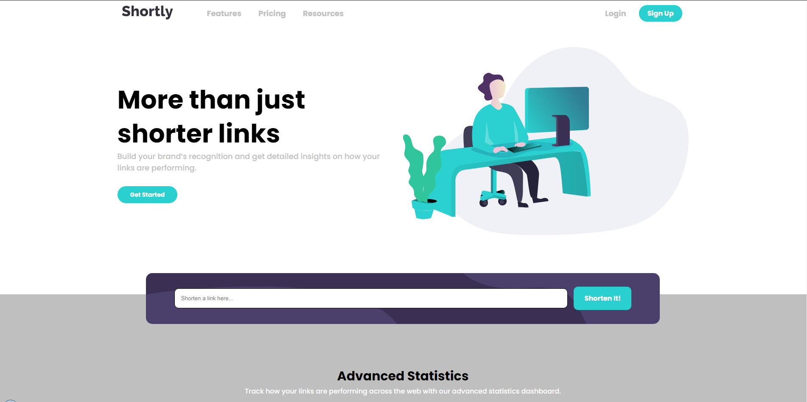

<h1 align="center"> Página de destino da API de encurtamento de URL </h1>

    

Criação do Pagina de Encurtamento de Url baseado no desafio proposto pela Frontend Mentor que sugeriu desafios reais do mercado de trabalho afim de ajudar no desenvolvimento de novas habilidades de programação.

## Descrição

 A Pagina de Encurtamento de Url foi baseado no desafio de programação da Frontend Mentor no qual sugeria o desenvolvimento de uma pagina de destino com uma API de encurtamento de URL feita em html, css, js, ajax e responsiva a partir de um esboço de como ficaria ela, que poder ser encontrado na pasta __doc__/__design__  nesse mesmo repositório. 

### Desafio proposto

os usuários devem ser capazes de:

* Visualize o layout ideal para o site, dependendo do tamanho da tela do dispositivo
Encurte qualquer URL válido
* Veja uma lista do seu link encurtado
* Receba uma mensagem de erro quando o 'form' for enviado se:
  * O inputcampo esta vazio
* Utilizar a API [shrtcode ](https://shrtco.de/)
 

## Construído com

* [HTML](https://www.w3schools.com/html/) - HTML abreviação para a expressão inglesa HyperText Markup Language, que significa: "Linguagem de Marcação de Hipertexto" é uma linguagem de marcação utilizada na construção de páginas na Web. Documentos HTML podem ser interpretados por navegadores. A tecnologia é fruto da junção entre os padrões HyTime e SGML.

* [CSS](https://www.w3schools.com/css/default.asp) - Cascading Style Sheets é um mecanismo para adicionar estilo a um documento web. O código CSS pode ser aplicado diretamente nas tags ou ficar contido dentro das tags "style". Também é possível, em vez de colocar a formatação dentro do documento, criar um link para um arquivo CSS que contém os estilos.

* [JAVASCRIPT](https://developer.mozilla.org/pt-BR/docs/Glossary/Semantics) - JavaScript é uma linguagem de programação interpretada estruturada, de script em alto nível com tipagem dinâmica fraca e multiparadigma. Juntamente com HTML e CSS, o JavaScript é uma das três principais tecnologias da World Wide Web

* [AJAX](https://www.w3schools.com/js/js_ajax_intro.asp) - Ajax é o uso metodológico de tecnologias como Javascript e XML, providas por navegadores, para tornar páginas Web mais interativas com o usuário, utilizando-se de solicitações assíncronas de informações. Foi inicialmente desenvolvida pelo estudioso Jessé James Garret e mais tarde por diversas associações.

* [SEMÂNTICA](https://developer.mozilla.org/pt-BR/docs/Web/JavaScript) - O HTML semântico é a forma de deixar o site com suas informações bem explicadas e compreensíveis para o computador, ajudando até mesmo em sua busca no Google e facilitando o entendimento de leitores de acessibilidade.

* [SEO](https://www.w3schools.com/tags/tag_meta.asp) - Otimização de Sites é o conjunto de estratégias com o objetivo de potencializar e melhorar o posicionamento de um site nas páginas de resultados naturais nos sites de busca gerando conversões, sejam elas, um lead, uma compra, um envio de formulário, agendamento de consulta e outros.

## Autor

* **Cesar dos Santos de Almeida** - *responsável pela construção e desenvolvimento da Template*

## Licença
Este projeto está licenciado sob a licença MIT - consulte o arquivo  [LICENSE.md](LICENSE.md) para obter detalhes

## Agradecimentos

* [Frontend Mentor](https://www.frontendmentor.io/) - Responsável por disponibilizar o desafio e os materiais como ilustrações e imagens para a criação da calculadora

## Links
* [Página de destino da API de encurtamento de URL](https://www.frontendmentor.io/challenges/url-shortening-api-landing-page-2ce3ob-G) - link do desafio do Frontend Mentor.
* [Frontend Mentor](https://www.frontendmentor.io/) - link do site ofical do Frontend Mentor.

